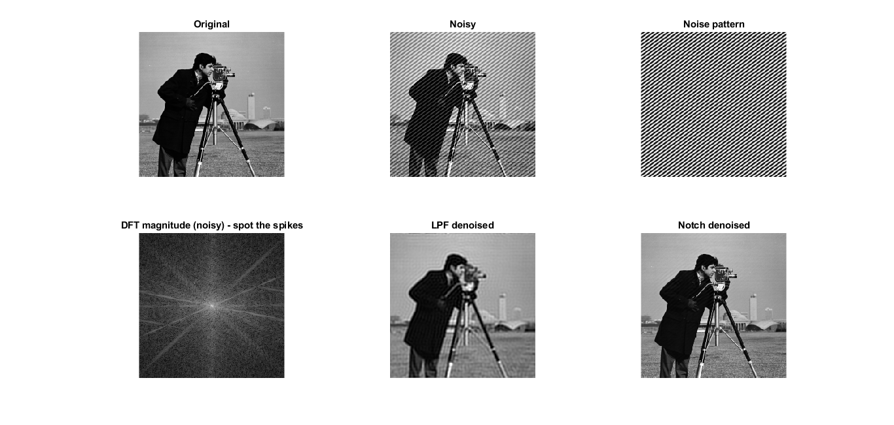

# 🔊 Sinusoidal Noise Denoising — Frequency-Domain Filtering in MATLAB

A MATLAB demonstration of **2-D sinusoidal noise injection and removal** using frequency-domain filtering techniques. Built as part of a Digital Signal Processing course.

---

## 📐 The Problem

A pure 2-D sinusoidal noise signal is added to a grayscale image:

```
noise(x, y) = A · sin(2π·fx·x/n + 2π·fy·y/m)
```

In the 2-D DFT, this sinusoid appears as exactly **two conjugate impulse spikes** located at `(±fx, ±fy)` — at a radial distance of:

```
r = √(fx² + fy²) = √(30² + 40²) = 50
```

This makes it a textbook case for frequency-domain filtering.

---

## 🧰 Filters Compared

### 1. Ideal Low-Pass Filter (LPF)
Passes all frequency components within a circular cutoff radius `rc`:

```
H_LPF(u,v) = 1  if √(u²+v²) ≤ rc
             0  otherwise
```

- ✅ Removes the noise (spike at r=50 falls outside cutoff=45)  
- ❌ Also suppresses high-frequency *image* detail → blurring

### 2. Ideal Notch Filter (NF)
Surgically zeros only the two conjugate spike locations:

```
H_NF(u,v) = 0  if |(u,v) - (±fx, ±fy)| ≤ r_notch
            1  otherwise
```

- ✅ Removes the noise precisely  
- ✅ Preserves the entire remaining image spectrum → sharper result  
- This is the **theoretically correct** approach for single-frequency noise

---

## 📊 Results

| Method          | PSNR (dB) | SSIM   |
|-----------------|-----------|--------|
| Noisy image     | ~17       | ~0.24  |
| LPF denoised    | ~24       | ~0.75  |
| Notch denoised  | ~45       | ~0.99  |

> Values are approximate — run the script to see exact results.

The notch filter achieves significantly higher PSNR and SSIM because it only removes the noise contribution, leaving the full image spectrum intact.

---

## 🖼️ Visualization

The script produces a 2×3 figure panel:

| | Col 1 | Col 2 | Col 3 |
|---|---|---|---|
| **Row 1** | Original image | Noisy image | Noise pattern |
| **Row 2** | DFT magnitude (spikes visible) | LPF result | Notch result |


---

## 🚀 How to Run

1. Open MATLAB (R2019b or later recommended)
2. Make sure `cameraman.tif` is available — it's built into MATLAB's Image Processing Toolbox
3. Run:
```matlab
DSP_noise_denoising
```

**Toolboxes required:** Image Processing Toolbox (for `psnr`, `ssim`, `imread`)

---

## 🎛️ Experimenting with Parameters

The key values are hardcoded near the top of each section and easy to find:

- **Noise amplitude** (`0.2`) — increase it to make the noise more severe
- **Noise frequencies** (`30`, `40`) — change these and watch the spikes move in the DFT panel
- **LPF cutoff** (`45`) — lower it to blur more, raise it toward 50 and the noise leaks through
- **Notch radius** (`6`) — too small and you miss the spike; too large and you start eating image content


---

## 🧠 Concepts Illustrated

- 2-D Discrete Fourier Transform (DFT) and its shift property
- Frequency-domain representation of sinusoidal signals (impulse pairs)
- Ideal filter design (LPF vs Notch) and their spatial-domain effects
- Trade-off between noise suppression and image sharpness
- Quantitative image quality metrics: PSNR and SSIM

---

## 📚 Course Context

Developed as part of a **Digital Signal Processing** course.  
Key reference: *Discrete-Time Signal Processing* — Oppenheim & Schafer.
